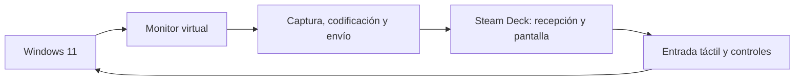

# WindowDeck

## Hoja de ruta técnica para desarrollar una segunda pantalla entre Windows 11 y Steam Deck

Estado de consolidación (2026-09-10): la ruta soportada del prototipo es driver → CPU/libx264 → Steam Deck y es la opción predeterminada del host y del panel. Las pruebas y rutas históricas se ejecutan mediante `windowdeck-host diag`; la ruta GPU nativa sigue siendo experimental y requiere validación completa en la Deck. El orden del trabajo pendiente está en la [roadmap de consolidación](windowdeck-roadmap-consolidacion.md), con las decisiones actuales en los [ADR 0016](docs/adr/0016-supported-video-routes.md) y [0017](docs/adr/0017-media-packaging.md). Los objetivos de esta hoja de ruta siguen siendo requisitos, no una lista de funciones ya entregadas.

Actualización del 11 de septiembre: `windowdeck-launcher` implementa el panel
y la gestión de procesos en Rust; el paquete abre `WindowDeck.exe`. La validación
automatizada cubre apertura, controles y cierre. La aceptación completa con la
Deck, otras escalas DPI e instalación limpia siguen abiertas; véase el
[ADR 0018](docs/adr/0018-rust-launcher.md).

Actualización del 12 de septiembre: el reproductor integrado ya recibe vídeo
del host CPU. El usuario acepta la latencia y el retorno de ventanas al detenerse.
Se verifican cierre inesperado del panel, retirada del monitor y reconexión;
véanse [ADR 0019](docs/adr/0019-cpu-integrated-player.md) y `docs/testing.md`.
Continúan pendientes UAC cancelado, otras escalas DPI, sesión prolongada e
instalación limpia. La ruta GPU conserva su estado experimental.

## 1. Visión del proyecto

WindowDeck permitirá utilizar la pantalla de una Steam Deck como un monitor secundario real de un PC con Windows 11.

Windows deberá detectar una pantalla adicional, permitir extender el escritorio hacia ella y transmitir su imagen a una aplicación ejecutada en SteamOS. La aplicación de la Steam Deck mostrará la imagen a pantalla completa y, en fases posteriores, devolverá al PC eventos de pantalla táctil, ratón, teclado y controles.

La conexión principal será por red local:

- Ethernet, preferentemente mediante el dock, para obtener la menor latencia y mayor estabilidad.
- Wi-Fi como opción cómoda.
- El HDMI del dock no se utilizará como entrada porque es una salida de vídeo.



## 2. Resultado esperado

Al abrir WindowDeck:

1. El usuario inicia `WindowDeck Host` en Windows.
2. Abre `WindowDeck Client` en la Steam Deck.
3. Los dispositivos se encuentran en la red local o se conectan mediante una IP introducida manualmente.
4. El usuario acepta el emparejamiento.
5. Windows crea o activa un monitor virtual de 1280 × 800.
6. El escritorio se extiende hacia la Steam Deck.
7. La Deck presenta la imagen a pantalla completa con baja latencia.
8. Al cerrar la conexión, el monitor virtual desaparece o queda desactivado de forma segura.

## 3. Principios de desarrollo

- Validar primero la transmisión de vídeo; desarrollar después el driver virtual.
- Mantener siempre una versión ejecutable y comprobable.
- Separar captura, codificación, transporte, decodificación, renderizado y entrada.
- No acumular fotogramas atrasados: en una pantalla remota es preferible descartar un frame antes que aumentar la latencia.
- Utilizar aceleración por hardware cuando esté disponible, pero conservar una ruta de compatibilidad por software.
- Evitar que el protocolo dependa de H.264 o de una implementación concreta.
- Hacer que resolución, frecuencia y códec se negocien según las capacidades de ambos equipos.
- Mantener la interfaz de usuario fuera del driver.
- Documentar decisiones importantes mediante ADRs en `docs/adr/`.
- No implementar un códec de vídeo propio. Se utilizarán las APIs del sistema o componentes multimedia maduros.

## 4. Alcance de la primera versión

### Incluido en la versión 0.1

- Host compatible con Windows 11.
- Cliente compatible con SteamOS 3.
- Conexión en una red local.
- Modo de escritorio extendido.
- Resolución base de 1280 × 800.
- 60 FPS como objetivo principal.
- H.264 como primer códec interoperable.
- Selección manual del cliente y emparejamiento local.
- Pantalla completa en la Steam Deck.
- Cursor visible y correctamente posicionado.
- Recuperación ante una desconexión temporal.
- Registro local de diagnóstico sin datos sensibles.

### Fuera del alcance inicial

- Uso a través de Internet.
- Servicios en la nube o cuentas de usuario.
- HDR.
- Audio.
- DRM o reproducción de contenido protegido.
- Compatibilidad con macOS.
- Compatibilidad general con Android, iOS u otros receptores.
- Varios clientes simultáneos.
- 90 FPS para Steam Deck OLED.
- Instalador comercial y firma definitiva del driver.

Estos elementos podrán añadirse cuando el flujo principal sea estable.

## 5. Arquitectura propuesta

### 5.1 Componentes de Windows

#### `windowdeck-host`

Aplicación o servicio en espacio de usuario responsable de:

- descubrir y emparejar clientes;
- administrar sesiones;
- negociar resolución, frecuencia, códec y bitrate;
- configurar el encoder;
- enviar vídeo;
- recibir métricas del cliente;
- recibir eventos de entrada;
- mostrar estado, errores y ajustes.

Lenguaje recomendado: Rust.

#### `windowdeck-capture`

Capa de captura desacoplada mediante una interfaz común:

```rust
pub trait FrameSource {
    fn capabilities(&self) -> FrameSourceCapabilities;
    fn start(&mut self, config: CaptureConfig) -> Result<(), CaptureError>;
    fn next_frame(&mut self) -> Result<CapturedFrame, CaptureError>;
    fn stop(&mut self) -> Result<(), CaptureError>;
}
```

Implementaciones previstas:

- `WindowsGraphicsCaptureSource`: para validar el sistema capturando una pantalla física existente.
- `DesktopDuplicationSource`: alternativa basada en DXGI para pruebas y comparación.
- `IndirectDisplaySource`: fuente definitiva alimentada por el monitor virtual.
- `SyntheticFrameSource`: patrón de prueba, colores, reloj y contador de frames.

Los frames de Windows deben permanecer en la GPU siempre que sea posible para evitar copias costosas GPU → CPU → GPU.

#### `windowdeck-encoder`

Responsabilidades:

- convertir el formato de color cuando sea necesario;
- codificar H.264 con baja latencia;
- solicitar keyframes;
- cambiar bitrate dinámicamente;
- exponer timestamps y estadísticas;
- proporcionar una implementación de software para diagnóstico.

Implementación actual: FFmpeg/libx264 en la ruta CPU soportada. La biblioteca opcional `windowdeck-media` implementa la ruta D3D11 y los encoders AMF/NVENC, pendiente de validación completa en la Steam Deck. La prueba inicial de Media Foundation se conserva en `diag encode`; no es el encoder de la ruta soportada. Véase el [ADR 0017](docs/adr/0017-media-packaging.md).

La abstracción no debe exponer tipos específicos de Media Foundation fuera del módulo Windows.

#### `windowdeck-virtual-display`

Driver de pantalla indirecta basado en UMDF e IddCx.

Responsabilidades:

- registrar un adaptador de pantalla indirecta;
- comunicar la conexión y desconexión del monitor virtual;
- anunciar modos compatibles;
- recibir las superficies DirectX generadas por Windows;
- entregar los frames a la tubería de codificación o a un proceso auxiliar;
- manejar correctamente cambios de modo, suspensión y cierre.

Modos iniciales:

- 1280 × 800 a 60 Hz.
- 1280 × 720 a 60 Hz como compatibilidad.
- 1920 × 1080 a 60 Hz como modo experimental con reescalado.

El driver debe partir del ejemplo oficial de Microsoft para Indirect Display Driver. Se recomienda C++ para esta pequeña capa porque el WDK y los ejemplos de IddCx están diseñados alrededor de C/C++. El resto del proyecto continuará en Rust.

El driver se ejecuta fuera de la sesión interactiva. Se plantearon estas posibilidades para evaluar el IPC:

1. Codificar dentro del componente IDD y enviar paquetes al servicio.
2. Compartir recursos D3D11 con el servicio mediante handles compartidos.
3. Copiar frames a memoria compartida como implementación temporal.

Los prototipos de transferencia CPU y D3D11 están registrados en los [ADR 0011](docs/adr/0011-driver-frame-transfer-probe.md) y [0012](docs/adr/0012-shared-d3d11-frame-probe.md). La ruta CPU funciona con el driver real; falta comparar ambos pipelines completos antes de cerrar el IPC definitivo. La codificación permanece en el host. La tercera opción es una alternativa histórica, no un requisito para introducir ahora un encoder en el driver.

#### `windowdeck-input-windows`

Componente futuro para convertir eventos remotos en entrada de Windows:

- ratón absoluto relativo al monitor virtual;
- clic izquierdo y derecho;
- rueda y gestos básicos;
- teclado;
- pantalla táctil;
- controles de la Steam Deck.

La primera implementación podrá utilizar `SendInput` para ratón y teclado. La emulación táctil y de gamepad se evaluará por separado porque puede requerir APIs o drivers adicionales.

### 5.2 Componentes de SteamOS

#### `windowdeck-client`

Aplicación Rust ejecutable en modo escritorio y, posteriormente, desde Game Mode.

Responsabilidades:

- descubrir el host;
- realizar el emparejamiento;
- negociar capacidades;
- recibir paquetes de vídeo;
- gestionar un jitter buffer mínimo;
- decodificar mediante hardware cuando esté disponible;
- presentar frames a pantalla completa;
- medir latencia, pérdida, FPS y frames descartados;
- capturar entrada y enviarla al host;
- mantener la pantalla activa durante una sesión.

#### Decodificación

Ruta inicial recomendada:

- H.264.
- GStreamer o FFmpeg/libav para acelerar el primer prototipo.
- VA-API como ruta de decodificación por hardware en la APU AMD de la Steam Deck.
- Decodificación por software como fallback.

La aplicación deberá detectar capacidades en tiempo de ejecución. No se debe asumir que un plugin concreto está instalado sin comprobarlo.

#### Presentación

- Crear una ventana sin bordes.
- Mostrar a pantalla completa sin escalado cuando la señal sea 1280 × 800.
- Mantener la relación de aspecto para otras resoluciones.
- Sincronizar de forma que no se cree una cola creciente de frames.
- Ofrecer un overlay de diagnóstico activable.

Para el prototipo se podrá delegar la presentación en GStreamer. Cuando la transmisión sea estable, se evaluará una ventana propia mediante `winit` y renderizado con `wgpu`, Vulkan o una integración directa apropiada.

### 5.3 Código compartido

#### `windowdeck-protocol`

Biblioteca Rust sin dependencias de interfaz gráfica ni del sistema operativo.

Debe contener:

- versión del protocolo;
- mensajes de descubrimiento y emparejamiento;
- negociación de capacidades;
- configuración de la sesión;
- cabeceras de frames y paquetes;
- eventos de entrada;
- telemetría;
- códigos de error serializables;
- pruebas de compatibilidad de mensajes.

#### `windowdeck-transport`

Abstracción del canal de comunicaciones:

```rust
pub trait SessionTransport {
    fn send_control(&mut self, message: ControlMessage) -> Result<(), TransportError>;
    fn send_video(&mut self, packet: VideoPacket) -> Result<(), TransportError>;
    fn receive_event(&mut self) -> Result<SessionEvent, TransportError>;
}
```

Para el primer prototipo se permite una conexión fiable sencilla. Cuando el vídeo funcione se migrará a:

- canal fiable para control, emparejamiento y configuración;
- canal de baja latencia para vídeo;
- descarte de frames obsoletos;
- secuencias, timestamps y detección de pérdida;
- solicitud de keyframe cuando el cliente pierda la referencia;
- cifrado autenticado.

QUIC es un candidato adecuado porque permite control fiable y datagramas bajo una misma sesión cifrada, pero debe validarse frente a una implementación RTP/UDP más sencilla. La elección se documentará con medidas reales, no solo por preferencia.

## 6. Estructura inicial del repositorio

```text
windowdeck/
├── Cargo.toml
├── LICENSE
├── README.md
├── ROADMAP.md
├── CONTRIBUTING.md
├── crates/
│   ├── windowdeck-protocol/
│   ├── windowdeck-transport/
│   ├── windowdeck-host/
│   ├── windowdeck-client/
│   ├── windowdeck-capture/
│   └── windowdeck-diagnostics/
├── driver/
│   └── windows-idd/
├── packaging/
│   ├── windows/
│   └── flatpak/
├── docs/
│   ├── architecture.md
│   ├── protocol.md
│   ├── security.md
│   ├── testing.md
│   └── adr/
├── scripts/
└── tests/
    ├── protocol/
    └── integration/
```

No es necesario crear todos los crates vacíos el primer día. Se añadirán cuando exista código que justifique la separación.

## 7. Protocolo mínimo

Todos los mensajes deben incluir una versión de protocolo. Los enteros enviados por red tendrán endianess definida y los límites de longitud se validarán antes de reservar memoria.

### Negociación

El cliente anuncia:

- versión de WindowDeck;
- versión de protocolo;
- resoluciones y frecuencias aceptadas;
- códecs y perfiles soportados;
- capacidad de decodificación por hardware;
- soporte táctil, ratón, teclado y gamepad;
- tamaño máximo de paquete.

El host responde con una configuración de sesión:

- identificador aleatorio de sesión;
- resolución;
- FPS;
- códec, perfil y nivel;
- bitrate inicial;
- intervalo de keyframes;
- modo de color;
- capacidades de entrada habilitadas.

### Datos de vídeo

Cada frame o fragmento debe incluir como mínimo:

- ID de sesión;
- número de frame;
- número de fragmento y total de fragmentos;
- timestamp monotónico de captura;
- indicador de keyframe;
- tamaño validado del payload.

El cliente nunca debe esperar indefinidamente un frame incompleto. Al vencer su plazo, lo descarta y continúa con el frame más reciente decodificable.

### Telemetría

Medidas necesarias:

- FPS capturados, codificados, recibidos, decodificados y mostrados;
- tiempo de captura y codificación;
- tiempo de red estimado;
- tiempo de decodificación y presentación;
- bitrate;
- pérdida y reordenamiento;
- frames descartados por cada etapa;
- longitud actual y máxima de las colas.

## 8. Seguridad básica

Estado actual (2026-09-10): el TCP de control y vídeo no está cifrado ni autentica dispositivos. Hay límites de tamaño y colas, validación de mensajes y fragmentos, y reglas de firewall del lanzador limitadas a redes privadas y subred local. mDNS no acredita la identidad del host. El [README](README.md#seguridad-actual) describe estas garantías y carencias; el bloque 4 de consolidación mantiene pendiente implementar el emparejamiento y proteger la conexión completa antes de activar el monitor.

Aunque la primera versión funcione solo en la red local, no debe aceptar conexiones anónimas sin conocimiento del usuario.

- Descubrimiento automático solamente en la red local.
- Confirmación visual del primer emparejamiento.
- Código temporal o comparación de un código corto en ambas pantallas.
- Claves persistentes por dispositivo después de aceptar el emparejamiento.
- Transporte cifrado y autenticado.
- Posibilidad de eliminar dispositivos emparejados.
- Límites estrictos para tamaños, resoluciones, FPS y mensajes.
- Nada de deserialización no acotada procedente de la red.
- No registrar claves, códigos de emparejamiento ni contenido de pantalla.
- La inyección de entrada estará desactivada hasta que el usuario la habilite.

## 9. Hoja de ruta por hitos

### Hito 0 — Fundamentos y repositorio

Objetivo: disponer de una base compilable, documentada y comprobable.

Estado actual (2026-09-10): el workspace tiene CI para Windows y Linux, tanto con la configuración base como con multimedia nativa, y empaquetado Flatpak. Los badges están en el README. El último commit publicado antes de esta consolidación, `ae6fcb6`, pasó [CI](https://github.com/ik3rurru/WindowDeck/actions/runs/34506074142) y [Flatpak](https://github.com/ik3rurru/WindowDeck/actions/runs/34506074101). Cada cambio nuevo debe pasar sus propias comprobaciones; estos jobs no sustituyen las pruebas del driver y de la Deck física.

Tareas:

- Inicializar repositorio Git y Cargo workspace.
- Elegir licencia: recomendación inicial `MIT OR Apache-2.0`.
- Crear `README.md`, `ROADMAP.md` y `CONTRIBUTING.md`.
- Configurar formato, lints y tests.
- Añadir CI para Windows y Linux.
- Definir errores comunes y logging estructurado.
- Crear `windowdeck-protocol`.
- Crear un pequeño ADR sobre el alcance del MVP.

Criterios de aceptación:

- `cargo fmt --check`, `cargo clippy` y `cargo test` pasan.
- El workspace compila en Windows y Linux.
- No existen dependencias circulares entre crates.
- README explica claramente que el HDMI del dock no es una entrada.

### Hito 1 — Conexión y patrón de prueba

Objetivo: validar la comunicación y la presentación sin introducir todavía captura ni códecs.

Tareas:

- Crear host y cliente de línea de comandos.
- Permitir conexión manual por IP y puerto.
- Implementar handshake versionado.
- Enviar una secuencia sintética de frames o un patrón animado.
- Dibujar número de frame y timestamp dentro del patrón.
- Mostrar el patrón en una ventana de la Steam Deck.
- Añadir contador de FPS y frames perdidos.
- Limitar todas las colas.

Criterios de aceptación:

- El cliente conecta, negocia y se desconecta limpiamente.
- El patrón funciona durante 30 minutos sin crecimiento continuado de memoria.
- Reiniciar cualquiera de los extremos no deja el otro bloqueado.
- Una versión de protocolo incompatible produce un error comprensible.

### Hito 2 — Captura real de Windows

Objetivo: transmitir una pantalla física existente antes de crear la pantalla virtual.

Tareas:

- Implementar `WindowsGraphicsCaptureSource`.
- Seleccionar una pantalla desde Windows.
- Obtener frames como superficies D3D11.
- Gestionar cambios de resolución y pérdida del dispositivo gráfico.
- Mostrar cursor.
- Añadir timestamps en el momento de captura.
- Comparar de forma breve Windows Graphics Capture y Desktop Duplication.

Criterios de aceptación:

- La Deck muestra una pantalla real de Windows.
- Captura 1280 × 800 o reescala correctamente hacia esa resolución.
- Los cambios de resolución no requieren reiniciar ambos procesos.
- No hay una copia de pantalla sin comprimir atravesando la red en la implementación final del hito.

### Hito 3 — Vídeo de baja latencia

Objetivo: obtener una experiencia utilizable a 1280 × 800 y 60 FPS.

Estado actual (2026-09-10): la ruta soportada negocia H.264/MPEG-TS a través del mismo TCP que el control, con captura CPU del driver y FFmpeg/libx264. El perfil está configurado a 1280 × 800, 60 Hz y 16 Mbps; no implica 60 fotogramas nuevos por segundo. La cola conserva como máximo dos chunks y tolera un bloqueo de hasta 10 segundos con el cliente anterior basado en FFplay. La corrección del bucle de reconexión se validó en la Deck con sesiones de 207 y 54 segundos y una pausa del cliente de 2 segundos que conservó la sesión.

La comparación CPU/WGC del 2026-09-08 favoreció subjetivamente a CPU, pero no utilizó contenido idéntico ni midió latencia absoluta. La ruta nativa de `windowdeck-media`, con D3D11, conversión y encoder de hardware en el host, está implementada y dispone de pruebas sintéticas y CI; todavía no está validada de extremo a extremo en la Deck.

Pendientes para cerrar este hito: medir latencia absoluta y estabilidad prolongada, contrastar Wi-Fi y Ethernet y validar el cliente y pipeline nativos. Las mediciones y sus límites se conservan en [docs/testing.md](docs/testing.md); los comandos actuales están en [docs/development.md](docs/development.md).

Tareas:

- Integrar H.264 de baja latencia.
- Activar codificación por hardware cuando exista.
- Integrar decodificación VA-API en SteamOS.
- Añadir bitrate configurable.
- Implementar keyframes y recuperación tras pérdida.
- Evitar B-frames y buffering orientado a reproducción convencional.
- Introducir control de ritmo y descarte de frames antiguos.
- Crear overlay y logs de rendimiento.
- Medir Wi-Fi y Ethernet por separado.

Objetivos de rendimiento iniciales, no garantías contractuales:

- 1280 × 800 a 60 FPS en Ethernet.
- Latencia visible de extremo a extremo inferior a 80 ms en una red local estable.
- Sin crecimiento de la cola de vídeo durante una sesión de una hora.
- Recuperación de una interrupción breve en menos de 3 segundos.
- Uso del encoder y decoder por hardware verificable en diagnóstico.

Si no se alcanzan, conservar las mediciones y perfiles antes de optimizar.

Prioridad acordada el 5 de septiembre de 2026: se conserva la calidad actual y se avanza al monitor virtual. El ajuste fino de latencia y las opciones de calidad parametrizables se aplazan; los criterios pendientes de este hito no se consideran cumplidos.

### Hito 4 — Monitor virtual de Windows

Objetivo: convertir el prototipo de mirroring en un segundo monitor real.

Estado actual (2026-09-10): el [driver C++ x64](driver/windows-idd/README.md) 0.1.0.9 crea el monitor virtual durante la sesión y entrega frames al host mediante la ruta CPU. El panel inicia el broker elevado y el host con `--driver-h264`; al ejecutar el host sin argumentos se selecciona la misma ruta. Las variantes WGC se conservan bajo `diag`. Esta consolidación no cambia la DLL ni requiere reinstalar el driver.

Se ha comprobado con el cliente anterior de la Deck la activación y retirada del monitor, el cierre del cliente y del host, la recuperación de desconexiones y pruebas de suspensión y bloqueo documentadas. También existen probes de transferencia CPU y D3D11; sus cifras no equivalen a una validación del vídeo GPU completo. El historial y las incidencias intermedias se conservan en [docs/testing.md](docs/testing.md) y [docs/continuation.md](docs/continuation.md).

El hito sigue abierto: faltan la comparación integrada CPU/GPU y la decisión final de IPC, pruebas de cambio de usuario y varias GPU, la consolidación del broker y la firma e instalación distribuible del driver. El encoder permanece en el host según el [ADR 0017](docs/adr/0017-media-packaging.md).

Tareas:

- Instalar Windows Driver Kit en el entorno Windows de desarrollo.
- Compilar y ejecutar el ejemplo oficial de IddCx en modo de prueba.
- Crear el adaptador y monitor `WindowDeck Display`.
- Anunciar 1280 × 800 a 60 Hz.
- Implementar conexión y desconexión controlada.
- Comparar las rutas CPU y D3D11 completas, con la codificación en el host, y cerrar la decisión de IPC mediante un ADR.
- Integrar el flujo de frames con el encoder.
- Manejar suspensión, bloqueo, cambio de usuario y reinicio del host.
- Documentar instalación y desinstalación segura.

Criterios de aceptación:

- El panel de configuración de Windows muestra un segundo monitor.
- El usuario puede elegir `Extender estas pantallas`.
- Una ventana puede arrastrarse desde el monitor principal hasta la Deck.
- Desconectar la Deck no deja ventanas inaccesibles permanentemente.
- El driver puede eliminarse utilizando el procedimiento documentado.
- Los fallos del cliente no bloquean ni reinician el escritorio de Windows.

Riesgo importante: para distribuir el driver fuera de un entorno de desarrollo habrá que estudiar firma, empaquetado y requisitos vigentes de Microsoft. Esto no debe bloquear el prototipo en modo de prueba.

### Hito 5 — Entrada desde la Steam Deck

Objetivo: que la pantalla secundaria también sea interactiva.

Orden de implementación:

1. Movimiento de ratón absoluto.
2. Clic principal y secundario.
3. Rueda y trackpad.
4. Teclado.
5. Pantalla táctil.
6. Gamepad y botones traseros.

Tareas:

- Crear mensajes versionados de entrada.
- Transformar coordenadas teniendo en cuenta escalado y orientación.
- Añadir interruptor visible para habilitar entrada remota.
- Interrumpir la inyección inmediatamente al perder autenticación o sesión.
- Limitar la frecuencia de eventos.
- Probar multimonitor y escalado de Windows al 100 %, 125 % y 150 %.

Criterios de aceptación:

- El toque o puntero actúa sobre el punto equivalente del monitor virtual.
- No se generan eventos después de cerrar la sesión.
- El usuario puede deshabilitar la entrada sin cerrar el vídeo.
- Una resolución incorrecta no puede enviar coordenadas fuera de límites.

### Hito 6 — Experiencia de usuario

Objetivo: eliminar la configuración técnica del uso diario.

Tareas:

- Descubrimiento local mediante mDNS o mecanismo equivalente.
- Emparejamiento gráfico.
- Recordar dispositivos autorizados.
- Selector de calidad: ahorro, equilibrado y calidad.
- Selector de resolución y frecuencia.
- Inicio y parada del monitor virtual.
- Reconexión automática opcional.
- Bandeja del sistema en Windows.
- Interfaz compatible con mando en Steam Deck.
- Mensajes claros para firewall, encoder no disponible y driver ausente.

Criterios de aceptación:

- Después de la instalación inicial, una sesión puede iniciarse con dos acciones o menos.
- Los errores comunes indican una acción concreta para resolverlos.
- La configuración avanzada no estorba al flujo principal.

### Hito 7 — Empaquetado y primera publicación

Objetivo: publicar una versión reproducible para pruebas externas.

Estado actual (2026-09-10): CI genera Flatpak y hay un script para crear el ZIP de Windows con ejecutables, FFmpeg, bibliotecas nativas, licencias, hashes y fuentes. El ZIP prepara su propio entorno multimedia y no requiere un FFmpeg instalado globalmente. Siguen pendientes la prueba en un Windows limpio, el instalador y distribución del driver, las actualizaciones y la primera publicación dirigida a usuarios externos. El [ADR 0017](docs/adr/0017-media-packaging.md) describe el límite entre el empaquetado existente y ese trabajo pendiente.

Tareas:

- Instalador de Windows para aplicación y driver.
- Paquete Flatpak para SteamOS.
- Instrucciones para añadir WindowDeck a Steam.
- Actualizaciones manuales verificables; posponer actualizador automático.
- Builds reproducibles cuando sea viable.
- Checksums y notas de versión.
- Política para reportar vulnerabilidades.
- Plantillas de issues y guía para obtener logs.
- Pruebas de instalación limpia y actualización.

Criterios de aceptación:

- Un usuario nuevo puede instalar ambos extremos siguiendo el README.
- Desinstalar restaura el sistema y retira el monitor virtual.
- La release incluye artefactos, checksums, changelog y limitaciones conocidas.

## 10. Backlog posterior a la versión 0.1

- 90 FPS para Steam Deck OLED.
- HEVC y AV1 según capacidades de ambos extremos.
- Audio opcional.
- Orientación vertical.
- Lápiz y presión si el dispositivo receptor lo soporta.
- Perfiles por aplicación.
- Cambio dinámico de bitrate y resolución.
- Varios monitores virtuales.
- Otros clientes Linux.
- Cable USB con red directa, si el comportamiento USB de ambos equipos lo permite de forma fiable.
- Integración más profunda con Game Mode.
- Canal de Internet mediante relay opcional, solo después de un diseño de seguridad específico.

## 11. Alternativa de hardware

WindowDeck podrá documentar, pero no tendrá que implementar inicialmente, una ruta mediante capturadora:

```text
HDMI del PC → entrada HDMI de capturadora → USB del dock → Steam Deck
```

En esta modalidad:

- Windows normalmente ve la capturadora como una pantalla física.
- SteamOS recibe vídeo mediante UVC/V4L2.
- La aplicación cliente puede mostrarlo.
- La resolución y latencia dependen de la capturadora.
- La entrada táctil seguirá necesitando un canal de retorno.

No confundir esta ruta con conectar directamente el HDMI del PC al HDMI del dock; ambos puertos son salidas.

## 12. Estrategia de pruebas

### Unitarias

- serialización y deserialización del protocolo;
- validación de límites;
- negociación de capacidades;
- fragmentación y reensamblado;
- transformación de coordenadas;
- control de colas y descarte de frames;
- máquinas de estado de sesión.

### Integración

- host y cliente locales con fuente sintética;
- pérdida, duplicación y reordenamiento simulados;
- desconexión durante handshake, vídeo e input;
- versiones de protocolo incompatibles;
- encoder o decoder no disponible;
- cambio de resolución durante una sesión.

### Hardware real

- Windows 11 con GPU AMD, NVIDIA e Intel, según disponibilidad.
- Steam Deck LCD a 60 Hz.
- Steam Deck OLED a 60 Hz y posteriormente 90 Hz.
- Ethernet por dock.
- Wi-Fi 5, 6 y 6E cuando haya hardware disponible.
- modo escritorio y Game Mode.

### Medición de latencia

No estimar la latencia únicamente a partir de logs de dos relojes distintos. Para una medida de extremo a extremo se utilizará inicialmente una grabación de alta velocidad que muestre simultáneamente el monitor original y la Steam Deck con un contador visual. Más adelante podrá añadirse sincronización de relojes y telemetría detallada.

## 13. Riesgos principales

| Riesgo | Impacto | Mitigación |
| --- | --- | --- |
| Complejidad y firma del driver de Windows | Alto | Posponer el driver hasta validar streaming; usar modo de prueba durante desarrollo. |
| Copias GPU/CPU innecesarias | Alto | Diseñar frames con ownership explícito y medir cada transferencia. |
| Latencia acumulada por colas | Alto | Colas acotadas, timestamps y política de descartar lo antiguo. |
| Diferencias entre GPUs y encoders | Alto | Abstracción de encoder, detección de capacidades y fallback. |
| Plugins multimedia ausentes en SteamOS | Medio | Comprobación al inicio y paquete Flatpak con dependencias controladas. |
| Cambios de SteamOS de solo lectura | Medio | No modificar el sistema base; distribuir mediante Flatpak o paquete autocontenido. |
| Pérdida o jitter en Wi-Fi | Medio | Bitrate adaptativo, keyframes solicitables y preferencia por Ethernet. |
| Superficie de ataque por red e input | Alto | Emparejamiento, cifrado, validación estricta y entrada desactivable. |
| Contenido protegido o DRM en negro | Medio | Declararlo fuera de alcance y no intentar eludir protecciones. |

## 14. Definición de terminado para la versión 0.1

WindowDeck 0.1 estará terminado cuando:

- Windows 11 detecte `WindowDeck Display` como segundo monitor.
- El escritorio pueda extenderse a 1280 × 800 y 60 Hz.
- La Steam Deck muestre esa pantalla durante una hora sin degradación progresiva.
- La conexión funcione por Ethernet y por Wi-Fi local.
- Una interrupción breve pueda recuperarse sin reiniciar Windows.
- Existan logs suficientes para identificar en qué etapa se pierde rendimiento.
- El usuario pueda autorizar, revocar y desconectar clientes.
- La instalación y desinstalación estén documentadas.
- Los tests automatizados y lints pasen.
- Las limitaciones conocidas estén publicadas.

## 15. Primer bloque de trabajo

El desarrollo debe comenzar exclusivamente por el Hito 0 y la parte mínima del Hito 1. No debe empezar todavía el driver IddCx ni la captura real.

### Entregables de la primera iteración

1. Inicializar el Cargo workspace.
2. Crear `windowdeck-protocol`, `windowdeck-host` y `windowdeck-client`.
3. Definir mensajes `Hello`, `Capabilities`, `SessionConfig`, `Start`, `Stop`, `Ping`, `Pong` y `Error`.
4. Implementar serialización con límites de tamaño explícitos.
5. Crear una máquina de estados de conexión pequeña y comprobable.
6. Permitir que cliente y host se conecten manualmente por IP.
7. Enviar un patrón de prueba de resolución reducida con número de frame y timestamp.
8. Mostrar métricas en consola.
9. Añadir tests para mensajes válidos, truncados, sobredimensionados y con versión incompatible.
10. Documentar cómo ejecutar ambos procesos en dos ordenadores de la misma red.

### Restricciones de desarrollo

- Presentar un plan breve antes de modificar archivos.
- Inspeccionar el repositorio antes de crear estructura.
- Implementar cambios pequeños y verificables.
- Ejecutar formato, lints y tests al cerrar cada iteración.
- No ocultar errores mediante `unwrap()` en rutas de red o datos externos.
- No introducir `unsafe` sin aislarlo, justificarlo y añadir pruebas alrededor.
- No añadir una dependencia si la biblioteca estándar resuelve el problema con claridad comparable.
- No optimizar sin guardar primero una medición reproducible.
- Actualizar el roadmap y los ADRs cuando cambie una decisión arquitectónica.
- No afirmar compatibilidad con SteamOS hasta probar el binario en una Steam Deck real.

## 16. Referencias oficiales de partida

- [Microsoft: Indirect Display Driver overview](https://learn.microsoft.com/en-us/windows-hardware/drivers/display/indirect-display-driver-model-overview)
- [Microsoft: Windows Graphics Capture](https://learn.microsoft.com/en-us/windows/apps/develop/media-authoring-processing/screen-capture)
- [Microsoft: Desktop Duplication API](https://learn.microsoft.com/en-us/windows/win32/direct3ddxgi/desktop-dup-api)
- [Valve: especificaciones técnicas de Steam Deck](https://www.steamdeck.com/en/tech)
- [Valve: Steam Deck Docking Station](https://www.steamdeck.com/en/dock)

## 17. Resumen de la secuencia correcta

```text
Conexión básica
→ patrón de prueba
→ captura de pantalla física
→ H.264 a baja latencia
→ mediciones reales
→ monitor virtual IddCx
→ entrada táctil y controles
→ experiencia de usuario
→ instaladores y publicación
```

La primera meta no es construir inmediatamente un reemplazo completo de Moonlight. Es demostrar una tubería mínima, medible y estable que convierta un frame producido por Windows en un frame mostrado por la Steam Deck. El monitor virtual se añadirá únicamente cuando esa tubería ya funcione.

Estado acordado el 2026-09-08: optimización de FPS pausada por aceptación del usuario del uso normal estable. Los 60 FPS continuos de presentación siguen sin certificación instrumental. No iniciar integración GPU sin una nueva tarea; ver docs/fps-pacing-review.md.
